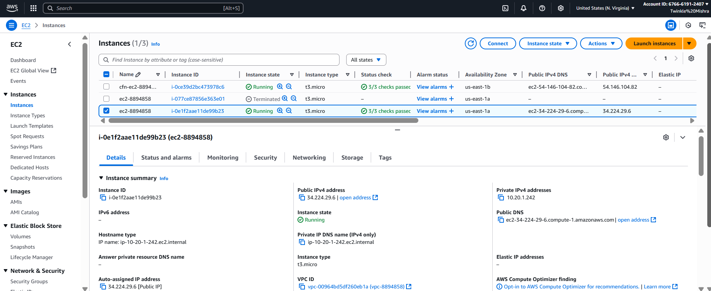

# PROG 8870 — Final Project: AWS Infrastructure Automation with Terraform & CloudFormation

This repo shows a small AWS environment provisioned two ways:
- **Terraform**: S3 (private, versioned), VPC + public subnet, Security Group, EC2, RDS (MySQL) + subnet group.
- **CloudFormation (YAML)**: S3 (private + PublicAccessBlock), EC2 (with VPC/IGW/route table), and a **public** demo RDS.

> You can re‑run everything using the commands below, and verify using the screenshots included in the `images/` folder.

---

## 0) Prerequisites

- AWS CLI v2 & Terraform installed
- IAM user/role with sufficient permissions
- An RSA key pair for EC2 (download the `.pem` to your working dir)

```bash
# configure your profile first if needed
aws configure
```

---

## 1) Environment setup (variables)

> Replace the placeholders to match your setup.

```bash
export AWS_REGION="us-east-1"
export AWS_DEFAULT_REGION="$AWS_REGION"

# EC2 key pair (the logical name in AWS, not the pem filename)
export KEY_NAME="twinkle-key"

# Your IP/CIDR for SSH access to EC2 (22)
export SSH_CIDR="x.x.x.x/32"

# RDS credentials used by both TF and CFN demos
export DB_USER="adminuser"
export DB_PASS='StaYAlive_2025!'
```

Verification:


---

## 2) Terraform — S3, EC2, RDS

### 2.1 Init & Plan
```bash
terraform -chdir=terraform init
terraform -chdir=terraform plan
# (optional second plan if you tweaked vars)
terraform -chdir=terraform plan -var-file=terraform.tfvars
```
Screens:
- Init: 
- Plan:  

### 2.2 Apply
```bash
terraform -chdir=terraform apply -auto-approve
```
Screens:
- Apply (running): 
- Apply (complete): 

### 2.3 Outputs & quick checks
```bash
terraform -chdir=terraform output
terraform -chdir=terraform output -raw ec2_public_ip
```
Screens:
- Outputs: 

### 2.4 S3 (private + versioning)
List TF buckets and show versioning:
```bash
aws s3api list-buckets --query "Buckets[?starts_with(Name, 'twinkle-8894858-tf-')].[Name]" --output table --region "$AWS_REGION"
aws s3api get-bucket-versioning --bucket <one-bucket-name> --region "$AWS_REGION"
```
Screens: 

### 2.5 EC2 (public IP + SSH)
```bash
EC2_IP="$(terraform -chdir=terraform output -raw ec2_public_ip)"
ssh -o StrictHostKeyChecking=accept-new -i "${KEY_NAME}.pem" ec2-user@"$EC2_IP"
```
Screens:  

### 2.6 MySQL client on EC2 + connect to TF RDS
On the EC2 shell:
```bash
sudo dnf install -y mariadb105
mysql --version

# Sample query (use your TF RDS endpoint and creds)
ENDPOINT="<tf-rds-endpoint>"
mysql -h "$ENDPOINT" -u "$DB_USER" -p -e "SELECT VERSION() AS mysql_version, NOW() AS server_time;"
```
Screens:  

Create a quick demo table:
```bash
mysql -h "$ENDPOINT" -u "$DB_USER" -p <<'SQL'
CREATE DATABASE IF NOT EXISTS proj8870db_demo;
USE proj8870db_demo;
CREATE TABLE IF NOT EXISTS ping (
  id INT PRIMARY KEY AUTO_INCREMENT,
  note VARCHAR(100),
  ts TIMESTAMP DEFAULT CURRENT_TIMESTAMP
);
INSERT INTO ping (note) VALUES ('hello from EC2');
SELECT * FROM ping;
SQL
```
Screen: 

---

## 3) CloudFormation — S3, EC2, RDS

> All templates live in `cloudformation/`.

### 3.1 S3 (3 private buckets with PAB + optional versioning)
```bash
aws cloudformation deploy \
  --stack-name cfn-s3-8894858 \
  --template-file cloudformation/s3.yaml \
  --parameter-overrides BucketPrefix=twinkle-8894858 Suffix=demo EnableVersioning=true \
  --capabilities CAPABILITY_NAMED_IAM \
  --region "$AWS_REGION"
```
Screens:
- Deploy + verify versioning: 

### 3.2 EC2 (VPC + IGW + route + outputs)
```bash
aws cloudformation deploy \
  --stack-name cfn-ec2-8894858 \
  --template-file cloudformation/ec2.yaml \
  --parameter-overrides KeyName="$KEY_NAME" SSHCidr="$SSH_CIDR" \
  --capabilities CAPABILITY_NAMED_IAM \
  --region "$AWS_REGION"

aws cloudformation describe-stacks \
  --stack-name cfn-ec2-8894858 \
  --query "Stacks[0].Outputs" \
  --region "$AWS_REGION"
```
Screens:  

### 3.3 RDS (public demo for assignment)
```bash
# If your shell expands '!' you may need: set +H
aws cloudformation deploy \
  --stack-name cfn-rds-8894858 \
  --template-file cloudformation/rds.yaml \
  --parameter-overrides DBName=proj8870db MasterUsername="$DB_USER" MasterPassword="$DB_PASS" \
  --capabilities CAPABILITY_NAMED_IAM \
  --region "$AWS_REGION"
# set -H
```
Screens:
- Deploy: 

Get the endpoint & run a simple query:
```bash
aws rds describe-db-instances \
  --query "DBInstances[?PubliclyAccessible==\`true\`].Endpoint.Address | [0]" \
  --output text --region "$AWS_REGION"

# From EC2 host
CFN_ENDPOINT="<cfn-rds-endpoint>"
mysql --connect-timeout=5 --protocol=TCP \
  -h "$CFN_ENDPOINT" -u "$DB_USER" -p -e "SELECT NOW() AS cfn_rds_time;"
```
Screens:  

### 3.4 AWS Console proof (highlights)
- S3 buckets (CFN):   
- S3 versioning (TF bucket):   
- EC2 instance details:   
- SG inbound (SSH):   
- VPC subnets:   
- VPC route table (0.0.0.0/0 → IGW):   
- RDS (TF instance):   
- RDS (CFN instance):   
- CFN stacks dashboard:   
- CFN EC2 Outputs tab: 

---

## 4) Code References (screens)

- **Terraform variables**:   
- **CFN S3 YAML**:   
- **CFN RDS YAML**:   
- **CFN EC2 YAML**:   
- **TF EC2 + SSM AMI**:   
- **TF S3 versioning**: 

---

## 5) Clean-up (avoid charges)

```bash
# Terraform
terraform -chdir=terraform destroy -auto-approve

# CloudFormation (delete stacks in reverse order if they depend on each other)
aws cloudformation delete-stack --stack-name cfn-rds-8894858 --region "$AWS_REGION"
aws cloudformation wait stack-delete-complete --stack-name cfn-rds-8894858 --region "$AWS_REGION"

aws cloudformation delete-stack --stack-name cfn-ec2-8894858 --region "$AWS_REGION"
aws cloudformation wait stack-delete-complete --stack-name cfn-ec2-8894858 --region "$AWS_REGION"

aws cloudformation delete-stack --stack-name cfn-s3-8894858 --region "$AWS_REGION"
aws cloudformation wait stack-delete-complete --stack-name cfn-s3-8894858 --region "$AWS_REGION"
```

---
